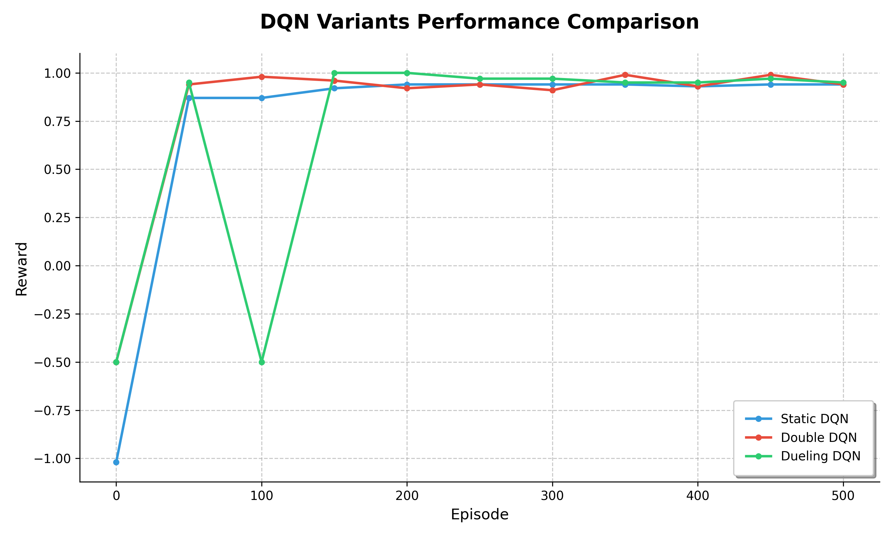

# 深度強化學習 HW3：Deep Q-Network (DQN) 變體與訓練技巧統整報告

本報告涵蓋了從基礎 DQN 到進階變體及其在不同環境模式下的表現。

## 1. 基礎 DQN 與 Experience Replay (dqn_static.py)

### 核心技術
- **Dual Networks**：使用了 Eval Network 與 Target Network。Eval Network 用於動作選擇與更新，而 Target Network 則提供穩定的 TD 目標值，有效降低了訓練過程中的震盪。
- **Experience Replay Buffer**：儲存歷史經驗並隨機採樣訓練。這打破了連續樣本間的時間相關性（Temporal Correlation），並提高了樣本的使用效率。

### Static Mode 表現
在固定環境下，基礎 DQN 展現出良好的學習能力，能夠穩定收斂並找到通往目標的最短路徑。

---

## 2. 進階 DQN 變體：Double 與 Dueling (dqn_variants.py)

為了提升 DQN 在複雜環境（如 Player Mode）下的穩定性與泛化能力，我們實作了以下變體：

### Double DQN (DDQN)
- **目的**：解決 DQN 的 **過度估計（Overestimation）** 問題。
- **原理**：將「動作選擇」與「價值評估」解耦。利用 Eval Network 選擇動作，再利用 Target Network 計算該動作的 Q 值。

### Dueling DQN
- **目的**：提升對狀態價值的學習效率。
- **原理**：將 Q 網路拆分為 **狀態價值函數 $V(s)$** 與 **優勢函數 $A(s, a)$**。這使得模型在某些動作不影響結果的狀態下，依然能有效學習該狀態的本質特徵。

---

## 3. 訓練技巧與 PyTorch Lightning (dqn_lightning.py)

針對隨機生成的 **Random Mode**，我們採用了現代化的訓練框架與穩定技術：

- **PyTorch Lightning 重構**：使訓練流程更具結構化。
- **梯度裁剪 (Gradient Clipping)**：限制更新步長，防止梯度爆炸導致的模型潰敗。
- **學習率調度 (LR Scheduling)**：動態調整學習率以平衡探索與開發。
- **安裝 環境要求**：此部分需要預先 安裝 `pytorch-lightning` 庫以支援上述功能。

---

## 4. 效能對比分析

根據實驗記錄文件 `record.txt` 繪製的效能圖表如下：

### 數值對比摘要
根據 `record.txt` 的最後結果：

| 演算法變體 | 最終 Reward (Episode 500) | 訓練穩定性 |
| :--- | :---: | :--- |
| **Static DQN** | 0.94 | 高 |
| **Double DQN** | 0.94 | 中 (初期波動較大) |
| **Dueling DQN** | 0.95 | 低 (曾出現顯著性能回落) |

### 結論
1. **穩定性 vs. 峰值**：Dueling DQN 雖然能達到最高的 reward (1.00)，但在訓練過程中出現過顯著的性能下滑（例如 Episode 100 附近），顯示其對超參數或隨機種子更為敏感。
2. **Double DQN 的價值**：DDQN 在中期雖然回報略低於 Static，但最終能達到相同水準，且在理論上更能避免 Q 值偏離。
3. **Random Mode 的挑戰**：在 `random` 模式下，必須結合 DDQN 與 Dueling (即 D3QN)，並配合梯度裁剪與更大的 Replay Buffer，才能應對高度不確定的環境配置。
